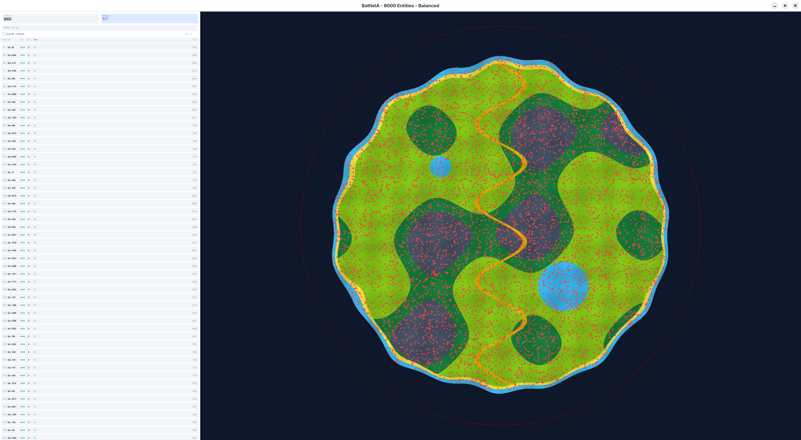

# BattleIA - 1.0.0 (BETA)



BattleIA est une simulation de combat épique où des centaines d'entités s'affrontent dans une arène dynamique. Ce projet met en œuvre un système d'**IA évolutive** basé sur des algorithmes génétiques.

## 🧠 Intelligence Artificielle & Apprentissage

Chaque bot possède un "cerveau" unique avec des traits de personnalité qui dictent son comportement :
*   **Aggression** : Détermine la distance d'engagement et la fréquence des tirs.
*   **Greed** : Influence la priorité donnée à la collecte d'objets et d'armes.
*   **Precision** : Affecte la dispersion des tirs.
*   **TeamSpirit** : Prévu pour les futures tactiques de groupe.

### Système d'Évolution (Algorithme Génétique)
À la fin de chaque round, une sélection naturelle s'opère :
1.  **Sélection** : Les 25% meilleurs bots (basés sur leur score ELO) survivent.
2.  **Reproduction & Mutation** : Les bots restants sont remplacés par des descendants des survivants.
3.  **Adaptation** : Des mutations aléatoires sont appliquées aux traits du cerveau, permettant à la population de "découvrir" de meilleures stratégies de survie au fil des générations.

## 🚀 Installation & Build

### Prérequis (Fedora)
```bash
sudo dnf install raylib-devel
```

### Compilation (Linux)
```bash
make
```

### Lancement
```bash
./BattleIA_App
# ou via le Makefile
make run
```

## 🎮 Commandes
*   **Clic Gauche** : Sélectionner une entité.
*   **Clic Droit** : Déplacer la caméra / Désélectionner.
*   **Molette** : Zoom / Dézoom.
*   **F11** : Plein écran.

## 🛠️ Technologies
*   **Langage** : C++17
*   **Graphismes** : [Raylib](https://www.raylib.com/)
*   **Architecture** : Système de gestion d'entités spatialement optimisé (Spatial Grid).

---
*Développé avec passion pour l'expérimentation de l'IA.*
